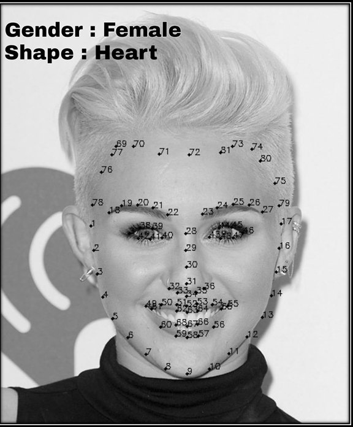

# 💇‍♀️ Hair Style Suggester

**Hair Style Suggester** is a project that uses trained facial recognition models to analyze your facial features and determine your unique face shape. Based on this analysis, it recommends hairstyles that best complement your natural geometry—so you don’t have to go through the eternal struggle of "will this haircut look good on me?"

Because let’s be honest: choosing the right hairstyle can sometimes feel harder than solving a Dynamic Programming problem. At least in DP, there's an optimal solution. But with hair? One wrong snip and you're in damage control for months.

This project brings logic to the chaos, using real facial metrics and trained models to offer data-driven hairstyle suggestions tailored just for you. No more endless Pinterest scrolling or haircut regrets—just science-backed style choices.

---

## 📸 Demo

### Website Front


### Face Shape Detection  


### Hairstyle Suggestions  


---

## ✨ Features

- 🧠 Facial metric analysis using trained models
- 🔍 Face shape classification (Oval, Round, Square, Heart, etc.)
- 💇 Hairstyle suggestions based on face geometry
- 📷 Upload image or use webcam for live analysis
- 💻 Simple and responsive interface

---

## 🧠 How It Works

1. User uploads a photo or uses the webcam.
2. The system detects key facial landmarks using a trained model (Dlib/Mediapipe).
3. Based on geometric proportions (forehead width, cheekbones, jawline), the face shape is classified.
4. Relevant hairstyle suggestions are presented according to the face shape.

---

## 🧰 Tech Stack

- **HTML/CSS/JavaScript** for frontend interface
1. **User Model:** Manages user data, including authentication information.
2. **Repository Model:** Stores repository metadata and links to files stored on AWS S3.
3. **Commit Model:** Stores commit information, including timestamps and changes made.


### Installation

1. **Clone the repository:**
   ```bash
   git clone https://github.com/yourusername/repo-forge.git
   cd repo-forge


